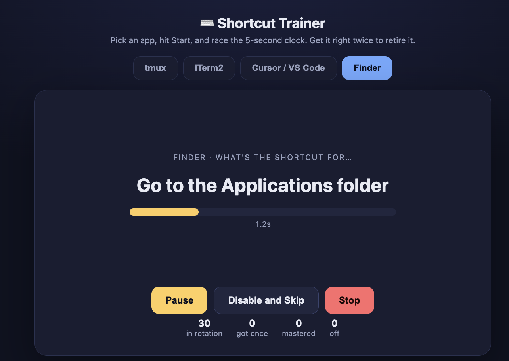
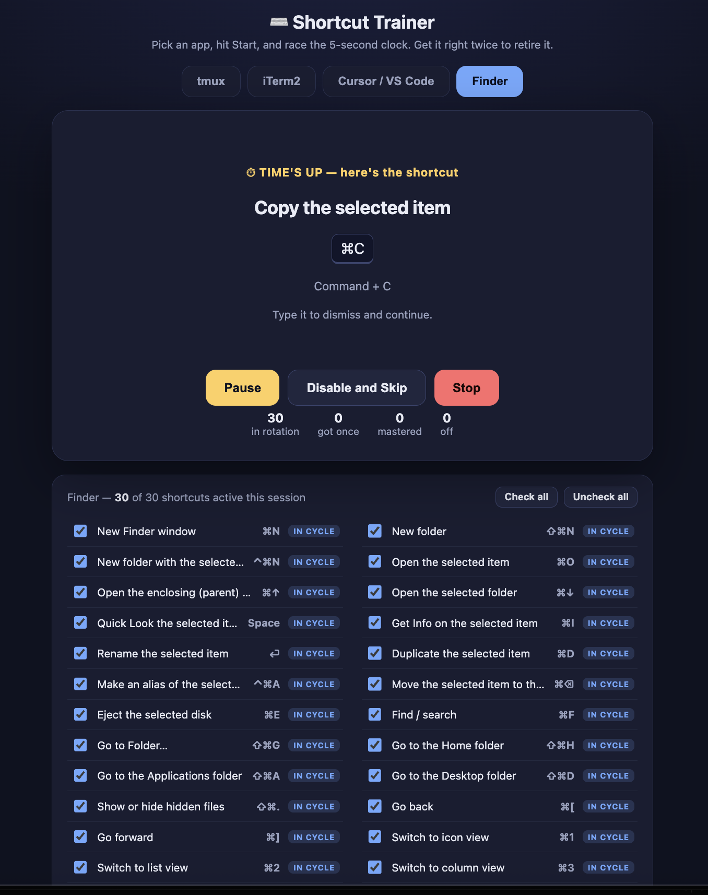

# Shortcut Practice

A keyboard-shortcut drill game that runs entirely in your browser. One HTML file, no build step,
no server, no dependencies.

Pick an app, hit **Start**, and race a 5-second clock to type the shortcut for the action on screen.



---

## How it works

The app is organized into tabs — one per app, each a separate practice session with its own
shortcut set. Open `index.html` to see what's currently there; tmux, iTerm2, Cursor/VS Code,
Finder, Vim, and Claude Code have been the mainstays.

The tab list isn't fixed. Ask Claude Code (or your AI tool of choice) to add one for an app you use,
or drop one you don't. See
[Customizing the shortcut list](#customizing-the-shortcut-list-with-claude-code) below.

### The round loop

1. A command name appears — e.g. *"Split pane left / right (vertical)"* — and a 5-second timer starts.
2. **Correct** → happy chime, confetti, on to the next one.
3. **Wrong key** → beep, and the clock keeps running. Keep trying until time is up.
4. **Time's up** → the answer is revealed. You have to actually *type* it to move on, but it does **not**
   count as correct — the shortcut stays in rotation.



*A missed round, and the per-tab checklist underneath it.*

### How shortcuts retire

- **One correct answer** puts a shortcut on a 60-second cooldown, so you spend your time on the ones
  you don't know yet.
- **Two correct answers** retire it for the rest of the session.
- The game never ends on its own. It runs until you press **Stop** — or until every active shortcut
  is mastered.

### Controls

**Start** · **Pause / Resume** · **Stop** · **Play again**

Plus **Disable and Skip**, for when macOS or the browser swallows a combo before the page ever sees it.
It drops that shortcut for the session and moves on.

You never need the mouse. Every button has a keyboard shortcut, printed on the button itself so
there's nothing to memorize:

- `⌃⇧⏎` — Start / Play again
- `⌃⇧Space` — Pause / Resume
- `⌃⇧Q` — Stop
- `⌃⇧X` — Disable and Skip
- `⌃⇧1`…`⌃⇧6` — switch tabs, numbered left to right

They all live in the `Ctrl+Shift` family, which nothing in the shortcut data uses — and none of these
keys is drilled with Ctrl alone or Shift alone either, so one slipped modifier can't fire a button
instead of answering the prompt. Each shortcut works only while its button is actually on screen and
enabled.

### The checklist

Below the game card, every shortcut for the current tab is listed with a checkbox and a status badge:

- `in cycle` — active, not yet answered correctly
- `1 / 2` — got it once, one more to retire it
- `mastered` — retired for this session
- `off` — unchecked, out of rotation

Uncheck anything you don't want to drill and it leaves the rotation immediately, even mid-round.
**Check all** (`⌃⇧C`) / **Uncheck all** (`⌃⇧N`) are there for bulk changes. The stats row at the
bottom tracks *in rotation / got once / mastered / off*.

### Multi-key sequences

Some shortcuts are sequences, not single chords. tmux is the obvious case: press `Ctrl+B`,
**release it**, then tap the next key. The game handles this, and is forgiving if you don't
release the prefix cleanly.

### Notes

- Nothing persists across refreshes, by design. Reloading gives you a clean session.
- `Cmd+W` and `Cmd+Q` are deliberately left out of the data, so a session can't be lost mid-game.
- Key matching works on either the physical key or the produced character, so alternate keyboard
  layouts don't break it.

---

## Getting started

Clone the repo and open the file. That's the whole setup.

```bash
open index.html
```

On Linux use `xdg-open index.html`; on Windows, `start index.html`. Or just double-click the file
in a file browser.

To try a change, edit `index.html` and reload the page.

---

## Customizing the shortcut list with Claude Code

The shortcut data lives in a single `RAW` object near the top of the `<script>` block in
`index.html`, keyed by app. Everything else — the tabs, the checklist, the stats, the rotation —
derives from it, so adding or removing a shortcut, or a whole tab, is a one-place edit.

There's a `CLAUDE.md` in the repo that explains the file's structure, so Claude Code already knows
where things go. Run `claude` in the repo and ask in plain English.

### Adding shortcuts

> Add "Rename the current window" (Ctrl+B then comma) to the tmux tab.

> Add these three to the Finder tab: New Folder with Selection, Show/Hide the sidebar, and Go to Downloads.

> I keep forgetting the VS Code multi-cursor shortcuts. Add the common ones to the Cursor/VS Code tab.

### Removing shortcuts

> Remove "Go to tab 1" from the iTerm2 tab — the browser eats Cmd+1 before the game sees it.

> Drop all the tmux copy-mode shortcuts. I don't use them.

> The Finder tab has too many. Trim it down to the 15 I'd actually use day to day.

### Adding and removing tabs

> Add a tab for Chrome DevTools shortcuts.

> Add a Slack tab with the navigation shortcuts — I click around way too much in there.

> Remove the Finder tab. I don't practice those.

### Reshaping a whole tab

> Replace the tmux tab's shortcuts with just the pane-management ones — splitting, navigating, zooming, closing.

> I'm switching from iTerm2 to Ghostty. Swap that tab over to Ghostty's default shortcuts.

### Tuning the game

> Make rounds 8 seconds instead of 5 — I need more time on the sequences.

> Change it so it takes three correct answers to retire a shortcut instead of two.

The timing knobs (`ROUND_MS`, `COOLDOWN_MS`, `CELEBRATE_MS`) sit at the top of the game-state section
if you'd rather change them by hand.
